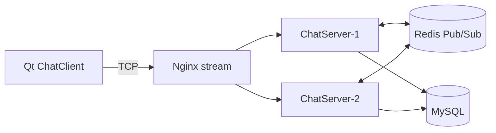

# MyChat · Modern C++ IM System

<p align="center">
  <b>一个面向高并发场景的 C++ 即时通讯项目</b><br/>
  <sub>Muduo + MySQL + Redis + Qt 客户端 + CMake 工程化构建</sub>
</p>

<p align="center">
  
  
  
  
  
</p>

---

## ✨ 项目简介

MyChat 是一个基于 C++ 的现代化即时通讯系统，具备完整的服务端与客户端实现：

- **高性能服务端**：采用 Muduo 网络框架，基于事件驱动 Reactor 模型，支持高并发连接
- **跨平台客户端**：Qt5/Qt6 Widgets 设计，提供现代化的用户界面
- **分布式架构**：支持 Redis Pub/Sub 多实例部署，实现跨节点消息路由

**核心功能**：用户登录注册、单聊群聊、好友管理、群组管理、离线消息存储与转发、多实例消息同步。

适合作为课程设计、毕业设计项目或后端面试技术展示。

---

## 🚀 核心亮点

| 特性 | 说明 |
|---|---|
| **高并发网络层** | 基于 Muduo 的事件驱动模型，Reactor 单线程模式 + 线程池，解耦连接管理与业务处理 |
| **完整 IM 基础能力** | 用户登录注册、好友管理、群聊、离线消息存储与拉取、在线状态推送 |
| **分布式扩展** | Redis Pub/Sub 支持多实例间跨节点消息分发，实现水平扩展 |
| **现代化客户端** | Qt 原生 UI（登录页、会话列表、联系人和群组管理、消息搜索） |
| **工程化交付** | CMake 模块化构建、自动化脚本、Release 打包、可配置编译选项 |
| **协议清晰** | JSON over TCP，消息格式定义明确，易于联调和扩展 |

---

## 📁 项目结构详解

```text
MyChatServer/
├── src/
│   ├── server/                    # 服务端核心代码（Linux 环境）
│   │   ├── main.cpp              # 入口点，初始化服务器
│   │   ├── chatserver.cpp        # 网络层：TCP 连接管理、事件分发
│   │   ├── chatservice.cpp       # 业务层：消息处理的单例类
│   │   ├── db/                   # MySQL 操作封装
│   │   ├── model/                # 数据模型（User、Friend、Group 等）
│   │   └── redis/                # Redis Pub/Sub 支持（可选）
│   └── client/                    # Qt 客户端代码（跨平台）
│       ├── main.cpp              # 应用入口
│       ├── ui/                   # UI 界面（登录、主窗口）
│       └── network/              # 网络通信层（QTcpSocket 封装）
├── include/
│   ├── public.hpp                # 协议消息类型定义
│   └── server/                   # 服务端头文件
├── thirdparty/
│   └── json.hpp                  # nlohmann/json 库（JSON 序列化）
├── scripts/
│   ├── autobuild.sh              # 自动化编译脚本
│   ├── package_release.sh        # Release 打包脚本
│   ├── run_client.sh             # 客户端运行脚本
│   └── chat.sql                  # 数据库初始化脚本
├── bin/                          # 编译输出目录
├── build/                        # CMake 构建目录
├── CMakeLists.txt                # CMake 配置文件
├── README.md                     # 项目说明
└── DEPLOYMENT.md                 # 部署与使用指南
```

---

## 🧰 技术栈

| 分层 | 技术 |
|---|---|
| 语言/标准 | C++11 |
| 构建系统 | CMake |
| 网络框架 | Muduo |
| 数据存储 | MySQL |
| 消息总线 | Redis Pub/Sub |
| 客户端 | Qt5/Qt6 Widgets |

---

## 🏗️ 系统架构



### 架构说明
- 客户端通过 TCP 与 ChatServer 通信。
- 多个 ChatServer 实例通过 Redis 进行跨节点消息同步。
- MySQL 负责用户、好友关系、群组、离线消息等持久化数据。

---

## ⚡ 快速开始

> **推荐流程**：先构建并运行客户端验证环境，再联调和部署服务端。

### 方案 A：仅编译 Qt 客户端（推荐初学者）

```bash
cd MyChatServer

# 构建客户端
BUILD_SERVER=OFF BUILD_CLIENT=ON ./autobuild.sh

# 运行客户端
./scripts/run_client.sh
```

### 方案 B：完整编译（服务端 + 客户端）

```bash
cd MyChatServer

# 一键编译
BUILD_SERVER=ON BUILD_CLIENT=ON ./autobuild.sh
```

### 方案 C：联调模式（推荐开发）

**终端 1：启动数据库和缓存服务**
```bash
# 启动 MySQL
sudo systemctl start mysql

# 启动 Redis（分布式部署时需要）
sudo systemctl start redis-server
```

**终端 2：启动服务端**
```bash
cd MyChatServer
./bin/ChatServer
```

**终端 3：启动客户端**
```bash
cd MyChatServer
./bin/ChatClient
```

### 方案 D：手动编译

```bash
cd MyChatServer
mkdir build && cd build

# 仅编译服务端
cmake -DBUILD_SERVER=ON -DBUILD_CLIENT=OFF ..
make -j$(nproc)

# 或仅编译客户端
cmake -DBUILD_SERVER=OFF -DBUILD_CLIENT=ON ..
make -j$(nproc)
```

---

## 📦 环境要求与依赖安装

### 前置条件

- **操作系统**：Linux（Ubuntu 20.04 LTS 推荐）或 Windows + WSL2
- **编译器**：GCC 5.0+ / Clang 3.8+ / MSVC 2017+（C++11 标准）
- **构建工具**：CMake 3.10+

### 服务端依赖（Linux）

```bash
# Ubuntu/Debian
sudo apt update
sudo apt install -y \
    build-essential \      # GCC、G++、Make
    cmake \               # CMake 构建系统
    default-libmysqlclient-dev \  # MySQL 客户端库
    libhiredis-dev \      # Redis 客户端库（可选）
    libmuduo-dev \        # Muduo 网络库
    redis-server \        # Redis 服务器
    mysql-server          # MySQL 数据库

# CentOS/RHEL
sudo yum groupinstall -y "Development Tools"
sudo yum install -y \
    cmake \
    mysql-devel \
    hiredis-devel \
    redis \
    mysql-server
```

**Muduo 库需要额外编译安装**（多数包管理器不提供）：

```bash
git clone https://github.com/chenshuo/muduo.git
cd muduo

# 编译
./build.sh

# 安装
cd build/release-cpp11
sudo make install
sudo ldconfig  # 更新动态链接库缓存
```

### 客户端依赖（跨平台）

**Qt 框架**：Qt5.15+ 或 Qt6.x（包含 Widgets 和 Network 模块）

- **Windows**：
  1. 下载 [Qt 在线安装器](https://www.qt.io/download-qt-installer)
  2. 选择 Qt5.15 或 Qt6.x，勾选 `Qt Widgets` 和 `Qt Network`
  3. 或使用 vcpkg：`vcpkg install qt5[core,gui,network]:x64-windows`

- **Linux**：
  ```bash
  sudo apt install -y qtbase5-dev qtbase5-dev-tools
  # 或 Qt6
  sudo apt install -y qt6-base-dev qt6-base-dev-tools
  
  # 验证安装
  qmake --version
  ```

- **macOS**：
  ```bash
  brew install qt
  # 或从 Qt 官网下载
  ```

---

## 📋 平台特定注意事项

### Linux 平台

✅ **完全支持**服务端和客户端  
✅ **推荐部署平台**  
✅ 与 Muduo 兼容性最佳

### Windows 平台

✅ **支持客户端编译和运行**  
⚠️ **服务端编译：** 需要 WSL2 或 Cygwin（Muduo 仅支持 Linux）  
💡 **建议方案**：Windows 开发客户端，Linux 虚拟机部署服务端

### macOS 平台

✅ **支持客户端编译和运行**  
⚠️ **服务端编译：** 需要 Docker 或虚拟机（Muduo 仅支持 Linux）

---

## � 核心功能与协议

### 用户模块
```cpp
LOGIN_MSG (1)          // 登录请求
LOG_MSG_ACK (2)        // 登录响应
REG_MSG (4)            // 注册请求
REG_MSG_ACK (5)        // 注册响应
LOGINOUT_MSG (3)       // 登出
```

### 好友模块
```cpp
ADD_FRIEND_MSG (7)          // 添加好友
DELETE_FRIEND_MSG (8)       // 删除好友
FRIEND_STATE_MSG (14)       // 好友在线状态变更（推送）
```

### 群组模块
```cpp
CREATE_GROUP_MSG (8)        // 创建群组
ADD_GROUP_MSG (9)           // 加入群组
QUIT_GROUP_MSG (10)         // 退出群组
```

### 消息模块
```cpp
ONE_CHAT_MSG (6)            // 单聊消息
GROUP_CHAT_MSG (13)         // 群聊消息
```

### 通信协议示例

**登录请求（JSON over TCP）**：
```json
{
  "msgid": 1,
  "id": 123,
  "password": "123456"
}
```

**登录成功响应**：
```json
{
  "msgid": 2,
  "errno": 0,
  "id": 123,
  "name": "john_doe",
  "friends": [
    {"id": 2, "name": "alice", "state": "online"},
    {"id": 3, "name": "bob", "state": "offline"}
  ],
  "groups": [
    {"id": 1, "groupname": "C++ 学习群", "users": [2, 3, 4]}
  ],
  "offlinemsg": [
    {"from": 2, "from_name": "alice", "msg": "hello", "time": "2025-01-10 14:30:00"}
  ]
}
```

**单聊消息**：
```json
{
  "msgid": 6,
  "id": 123,
  "to": 456,
  "msg": "你好，这是一条消息",
  "time": "2025-01-10 14:35:20"
}
```

---

## 🎯 功能特性

### ✅ 已实现

| 功能 | 客户端 | 服务端 | 数据库 |
|---|---|---|---|
| 用户注册登录 | ✅ | ✅ | ✅ |
| 好友管理 | ✅ | ✅ | ✅ |
| 单聊消息 | ✅ | ✅ | ✅ |
| 群组管理 | ✅ | ✅ | ✅ |
| 群聊消息 | ✅ | ✅ | ✅ |
| 离线消息 | ✅ | ✅ | ✅ |
| 在线状态推送 | ✅ | ✅ | — |
| Redis 跨实例同步 | ✅ | ✅ | — |

### 🔄 进行中

- [ ] 消息已读/未读标记
- [ ] 图片和文件消息支持
- [ ] 消息加密传输（TLS/SSL）
- [ ] 消息撤回功能

### 📋 规划中

- [ ] 视频通话支持（WebRTC）
- [ ] 消息数据库全文搜索
- [ ] Docker 一键部署
- [ ] Kubernetes 服务编排
- [ ] 消息中间件（Kafka）集成
- [ ] Web 管理后台

---

## 🖥️ 客户端 UI 特性

- **登录界面**：账号密码验证，记住密码功能
- **主窗口**：会话列表、联系人、群组管理
- **聊天窗口**：实时消息显示、时间戳、消息输入框
- **联系人管理**：搜索、添加、删除好友
- **群组管理**：创建群组、加入群组、群成员列表
- **在线状态**：实时显示好友在线/离线状态

---

## 🧠 服务端架构亮点

### 1. **网络层** （ChatServer）
- Reactor 单线程模型处理 I/O 事件
- 事件驱动，零阻塞设计
- TCP 长连接管理
- 消息序列化与反序列化（JSON）

### 2. **业务层** （ChatService）
- 单例模式集中管理业务逻辑
- 消息 ID 与处理函数绑定的分发机制
- 连接与用户映射
- 状态管理与事件推送

### 3. **数据持久化** （DB Module）
- MySQL 数据库操作封装
- 用户、好友、群组、离线消息表设计
- 连接池管理（可扩展）

### 4. **分布式扩展** （Redis Module）
- Pub/Sub 频道订阅，支持多实例间消息转发
- 跨实例用户状态同步
- 可选启用，不影响单实例部署

---

## 💼 面试要点

---

## 🎁 打包发布

```bash
cd MyChatServer
./scripts/package_release.sh
```

默认产物位置：
- 可执行文件：`bin/`
- 打包文件：`dist/`

当前示例产物：
- `bin/ChatClient`
- `dist/MyChat-1.0.0-Linux.tar.gz`

---

## 📸 界面展示（建议）

你可以将截图放在 `docs/images/` 后，按以下方式展示：

```markdown


```

---

## 💼 面试要点

### 系统架构
- **分层设计**：网络层（Muduo）→ 业务层（ChatService）→ 数据层（MySQL）
- **异步 I/O**：Reactor 模型，单线程处理网络事件 + 线程池处理业务
- **扩展性**：Redis Pub/Sub 支持多实例部署，水平扩展

### 技术深度
1. **C++ 现代特性**
   - 单例模式、观察者模式、工厂模式
   - 智能指针管理资源（RAII）
   - 仿函数与 std::function 绑定回调

2. **网络编程**
   - TCP 长连接管理，心跳保活机制
   - 非阻塞 I/O，事件驱动模型
   - JSON 序列化，协议设计

3. **数据库设计**
   - ER 图设计（用户、好友、群组、离线消息表）
   - 数据一致性与事务处理
   - SQL 优化与索引设计

4. **并发编程**
   - 线程安全，锁与同步原语（mutex）
   - 生产者-消费者队列
   - 原子操作与内存序

### 量级指标
- **并发连接数**：支持千级（Reactor 模型 + 线程池）
- **消息延迟**：毫秒级（Muduo 高效网络库）
- **数据可靠性**：MySQL 持久化 + Redis 缓存

### 性能优化
- 消息批处理减少网络开销
- 连接池复用 MySQL 连接
- Redis Pub/Sub 减少数据库轮询和查询

---

## 🎬 开发进阶建议

### 快速上手路线
1. **第 1-2 周**：编译并在本地运行完整项目
2. **第 2-3 周**：阅读服务端核心代码（chatserver.cpp、chatservice.cpp）
3. **第 3-4 周**：修改并添加新的消息类型（如文件传输）
4. **第 4-5 周**：搭建多实例测试环境，验证 Redis 分发能力
5. **第 5-8 周**：性能测试、压力测试、代码优化

### 进阶优化方向
- [ ] 使用 gRPC 替代 JSON over TCP（类型安全、自动序列化）
- [ ] 消息队列（RabbitMQ/Kafka）解耦业务层
- [ ] 缓存层（Redis）优化热点数据查询
- [ ] Protobuf 二进制序列化替代 JSON（减小消息体积）
- [ ] 容器化与云原生部署（Docker、Kubernetes）
- [ ] 监控告警（Prometheus + Grafana）

---

## 📚 相关文档

- [部署与使用指南](DEPLOYMENT.md) —— 详细的编译、部署、测试步骤
- [协议文档](docs/PROTOCOL.md) —— 消息类型定义与格式规范（建议补充）
- [架构设计](docs/ARCHITECTURE.md) —— 详细的架构文档（建议补充）

---

## 🗺️ 项目 Roadmap

## 🗺️ 项目 Roadmap

| 优先级 | 功能 | 状态 | 预计时间 |
|---|---|---|---|
| P0 | 消息已读/未读状态 | 📋 规划中 | Q2 2025 |
| P0 | 文件和图片消息 | 📋 规划中 | Q2 2025 |
| P1 | Docker 容器化部署 | 📋 规划中 | Q1 2025 |
| P1 | GitHub Actions CI/CD | 📋 规划中 | Q1 2025 |
| P2 | Web 管理后台 | 📋 规划中 | Q2 2025 |
| P2 | 消息全文搜索 | 📋 规划中 | Q3 2025 |
| P3 | 视频通话（WebRTC） | 💭 构想中 | 下半年 |

---

## 🤝 参与贡献

欢迎通过以下方式参与项目：

1. **提交 Issue**：报告 bug 或提出新功能建议
2. **发起 PR**：提交代码改进与新功能
3. **完善文档**：改进项目文档和注释
4. **性能优化**：涉及任何性能改进的代码

**贡献指南**：
1. Fork 本仓库
2. 创建特性分支 (`git checkout -b feature/AmazingFeature`)
3. 提交修改 (`git commit -m 'Add some AmazingFeature'`)
4. 推送到分支 (`git push origin feature/AmazingFeature`)
5. 创建 Pull Request

---

## 📞 联系方式


- **个人邮箱**：2624221890@qq.com

---

## 📄 许可证

本项目采用 **MIT 许可证**。详见 [LICENSE](LICENSE) 文件。

✅ 可自由用于商业和个人项目  
✅ 可修改和分发代码  
⚠️ 使用时需保留原作者信息

---

## 🙏 致谢

感谢以下开源项目的支持：
- [Muduo](https://github.com/chenshuo/muduo) —— 高效 C++ 网络库
- [Qt](https://www.qt.io/) —— 跨平台 GUI 框架
- [nlohmann/json](https://github.com/nlohmann/json) —— 现代 JSON 库
- [MySQL](https://www.mysql.com/) —— 关系型数据库
- [Redis](https://redis.io/) —— 高性能缓存与消息队列

---

**最后更新**：2025 年 1 月  
**维护者**：Tony

