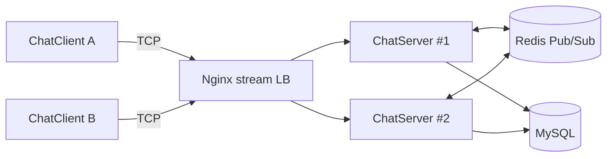

# MyChatServer

🚀 一款面向 Linux 的高性能即时通讯系统，覆盖单机与多机部署场景，支持横向扩展与实时消息分发。

## ✨ 亮点概览
- 🧠 高并发网络框架：服务端基于 Muduo，稳定支撑多连接高并发。
- 💬 完整 IM 能力：注册、登录、好友/群组、单聊/群聊、离线消息。
- 🧩 分布式消息路由：Redis 发布/订阅，跨服务器实时转发消息。
- ⚖️ 负载均衡：Nginx stream 实现 TCP 层负载均衡，多实例部署无缝扩容。
- 🗄️ 数据持久化：MySQL 存储用户、好友、群组、离线消息与状态。

## 🧱 系统架构
- **ChatServer**：负责连接管理、消息路由、状态维护。
- **ChatClient**：TCP 客户端，支持命令行交互与实时收发。
- **Redis**：跨节点消息中转与在线状态同步。
- **MySQL**：核心业务数据与离线消息存储。
- **Nginx stream**：TCP 负载均衡入口。

## 🗺️ 架构图

## ✅ 已实现功能
- 用户注册 / 登录 / 注销
- 好友管理（添加、列表）
- 群组管理（创建、加入、群聊）
- 单聊 / 群聊
- 离线消息拉取
- 多服务器消息转发（Redis Pub/Sub）
- TCP 负载均衡（Nginx stream）

## 🛠️ 技术栈
- **C++ / Linux**
- **Muduo**（高性能网络库）
- **MySQL**（持久化存储）
- **Redis**（消息中转）
- **Nginx stream**（TCP 负载均衡）

## 📦 部署形态
1) 单机模式：ChatServer + MySQL
2) 多机模式：多实例 ChatServer + Redis + Nginx 负载均衡

## 🧭 未来计划
- 🎨 Qt 图形化客户端
- 📊 在线状态与消息投递优化
- 🧪 更完善的容错与日志体系
- 📈 性能与监控增强

---

如需部署指导或扩展建议，欢迎提问与交流。
