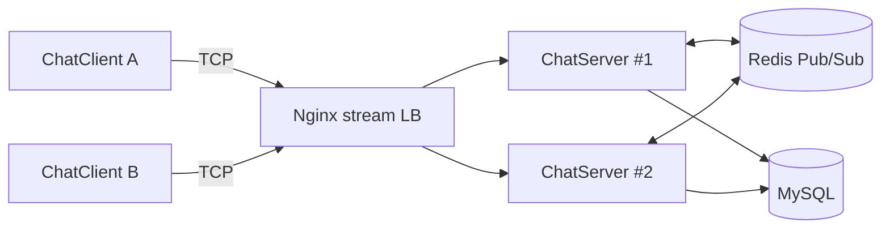

# MyChatServer

🚀 一款面向 Linux 的高性能即时通讯系统，覆盖单机与多机部署场景，支持横向扩展与实时消息分发。

## ✨ 亮点概览
- 🧠 高并发网络框架：服务端基于 Muduo，稳定支撑多连接高并发。
- 💬 完整 IM 能力：注册、登录、好友/群组、单聊/群聊、离线消息。
- 🧩 分布式消息路由：Redis 发布/订阅，跨服务器实时转发消息。
- ⚖️ 负载均衡：Nginx stream 实现 TCP 层负载均衡，多实例部署无缝扩容。
- 🗄️ 数据持久化：MySQL 存储用户、好友、群组、离线消息与状态。

## 🌟 项目定位
### 适用人群
- Linux/C++ 网络编程学习者与课程项目团队
- 需要实践高并发、分布式与负载均衡的开发者
- 想搭建可扩展 IM 原型的后端工程师

### 为什么做这个项目
- 传统单机聊天服务难以验证真实的多机部署与横向扩展
- 需要把“网络通信 + 数据持久化 + 分布式消息”完整串起来
- 用一个项目实践 Muduo、MySQL、Redis、Nginx 的工程组合

### 相比传统聊天服务器的优势
- ✅ 多机可扩展：Redis Pub/Sub + Nginx stream 支持跨节点消息转发
- ✅ 高并发能力：Muduo 事件驱动模型提升吞吐
- ✅ 状态更一致：在线状态、离线消息统一落库与同步
- ✅ 部署更灵活：单机/多机模式可切换，配置清晰
- ✅ 功能链路完整：注册、好友/群组、单聊/群聊、离线消息全覆盖

## 🧱 系统架构
- **ChatServer**：负责连接管理、消息路由、状态维护。
- **ChatClient**：TCP 客户端，支持命令行交互与实时收发。
- **Redis**：跨节点消息中转与在线状态同步。
- **MySQL**：核心业务数据与离线消息存储。
- **Nginx stream**：TCP 负载均衡入口。

## 🗺️ 架构图


## ✅ 已实现功能
- 用户注册 / 登录 / 注销
- 好友管理（添加、列表）
- 群组管理（创建、加入、群聊）
- 单聊 / 群聊
- 离线消息拉取
- 多服务器消息转发（Redis Pub/Sub）
- TCP 负载均衡（Nginx stream）

## 🛠️ 技术栈
- **C++ / Linux**
- **Muduo**（高性能网络库）
- **MySQL**（持久化存储）
- **Redis**（消息中转）
- **Nginx stream**（TCP 负载均衡）

## 🧰 编译方式
```bash
cd /项目所在目录
mkdir -p build
cd build
cmake ..
make -j
```

可执行文件通常输出到：
- `bin/ChatServer`
- `bin/ChatClient`

## 📁 目录结构说明
- `bin/`：构建输出的可执行文件
- `include/`：头文件与公共接口定义
- `src/`：核心源码（server/client/redis/db/model）
- `test/`：测试或示例代码
- `thirdparty/`：第三方依赖（如 json 库）
- `build/`：编译生成的中间文件
- `CMakeLists.txt`：构建配置入口

## ▶️ 运行步骤
### 1) 启动依赖
```bash
sudo systemctl start mysql
sudo systemctl start redis
```

### 2) 启动服务器
```bash
cd /项目所在目录/bin
./ChatServer
```

### 3) 启动客户端
```bash
cd /项目所在目录/bin
./ChatClient 127.0.0.1 6000
```

### 4) 多机/负载均衡场景
- 多台服务器运行 `ChatServer`，并统一连接同一个 Redis。
- Nginx stream 监听统一入口端口（如 9000），后端指向各 ChatServer 实例。
- 客户端连接 Nginx 入口：
```bash
./ChatClient 127.0.0.1 9000
```

## 🧾 常用 Linux 命令速查
### 服务管理
```bash
sudo systemctl status mysql 
sudo systemctl status redis
sudo systemctl status nginx

sudo systemctl start mysql
sudo systemctl start redis
sudo systemctl start nginx

sudo systemctl restart mysql
sudo systemctl restart redis
sudo systemctl restart nginx
```

### 端口检查
```bash
sudo ss -ltnp | grep 6000
sudo ss -ltnp | grep 9000
```

### 进程查看/关闭
```bash
ps -ef | grep ChatServer
pkill ChatServer
```

### 日志查看
```bash
tail -f /var/log/nginx/error.log
tail -f /var/log/nginx/access.log
```

### 数据库相关命令
```bash
# 进入 MySQL
mysql -u root -p

# 查看数据库与表
SHOW DATABASES;
USE chat;
SHOW TABLES;

# Redis 连接与查看
redis-cli -h 127.0.0.1 -p 6379
PING
```

## 📦 部署形态
1) 单机模式：ChatServer + MySQL
2) 多机模式：多实例 ChatServer + Redis + Nginx 负载均衡

## ⚙️ 配置说明
### MySQL
- 默认连接：`127.0.0.1:3306`
- 账号示例：`root/123456`
- 数据库：`chat`
- 表结构需提前初始化

#### 数据库初始化示例
```sql
CREATE DATABASE IF NOT EXISTS chat DEFAULT CHARSET=utf8mb4;
USE chat;

CREATE TABLE `user` (
  `id` INT PRIMARY KEY AUTO_INCREMENT,
  `name` VARCHAR(50) NOT NULL UNIQUE,
  `password` VARCHAR(50) NOT NULL,
  `state` ENUM('online', 'offline') DEFAULT 'offline'
);

CREATE TABLE `friend` (
  `userid` INT NOT NULL,
  `friendid` INT NOT NULL,
  PRIMARY KEY (`userid`, `friendid`),
  FOREIGN KEY (`userid`) REFERENCES `user`(`id`),
  FOREIGN KEY (`friendid`) REFERENCES `user`(`id`)
);

CREATE TABLE `allgroup` (
  `id` INT PRIMARY KEY AUTO_INCREMENT,
  `groupname` VARCHAR(50) NOT NULL,
  `groupdesc` VARCHAR(200) DEFAULT ''
);

CREATE TABLE `groupuser` (
  `groupid` INT NOT NULL,
  `userid` INT NOT NULL,
  `grouprole` ENUM('creator', 'normal') DEFAULT 'normal',
  PRIMARY KEY (`groupid`, `userid`),
  FOREIGN KEY (`groupid`) REFERENCES `allgroup`(`id`),
  FOREIGN KEY (`userid`) REFERENCES `user`(`id`)
);

CREATE TABLE `offlinemessage` (
  `userid` INT PRIMARY KEY,
  `message` VARCHAR(500) NOT NULL,
  FOREIGN KEY (`userid`) REFERENCES `user`(`id`)
);
```

### Redis
- 默认连接：`127.0.0.1:6379`
- 可通过环境变量配置：
```bash
export REDIS_HOST=你的Redis服务器IP
export REDIS_PORT=6379
```

### Nginx stream
示例（监听 9000，后端为两个 ChatServer）：
```nginx
stream {
	upstream tcp_backend {
		server 127.0.0.1:6000;
		server 127.0.0.1:6001;
	}
	server {
		listen 9000;
		proxy_pass tcp_backend;
	}
}
```

## 🧭 未来计划
- 🎨 Qt 图形化客户端
- 📊 在线状态与消息投递优化
- 🧪 更完善的容错与日志体系
- 📈 性能与监控增强
---

如需部署指导或扩展建议，欢迎提问与交流。
