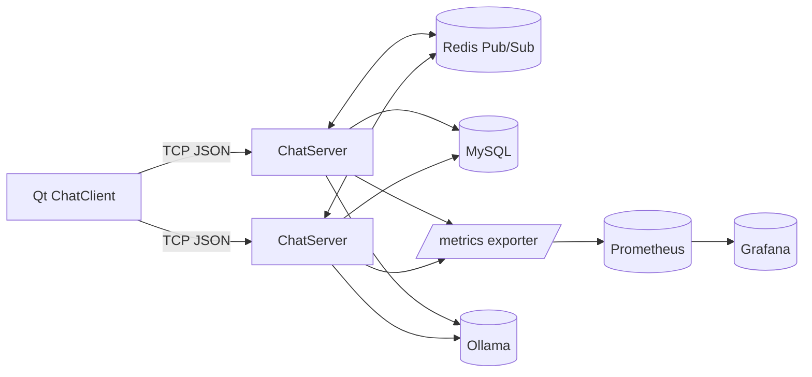

# MyChat · Modern C++ IM System

<p align="center">
  <b>一个覆盖服务端、客户端、可观测、压测与 AI 扩展的 C++ 即时通讯完整项目</b><br/>
  <sub>Muduo + MySQL + Redis + Qt + Prometheus/Grafana + Ollama + CMake</sub>
</p>

---

## 项目概览

MyChat 是一个 Linux-first 的即时通讯系统，核心目标是从“功能可用”升级到“工程可交付”。

当前项目包含完整链路：
- 服务端：连接管理、业务分发、消息路由、离线消息、好友/群组能力
- 客户端：登录注册、联系人与群组管理、会话窗口、AI 助手会话
- 运维与观测：健康检查、指标快照、Prometheus/Grafana 演示
- 数据与实验：压测数据生成、清理、检查、批次对比与可视化导出
- 扩展能力：本地 AI 模型接入（Ollama）

---

## 系统架构


```mermaid
flowchart LR
  C[Qt ChatClient] -->|TCP JSON| S1[ChatServer]
  C -->|TCP JSON| S2[ChatServer]
  S1 <--> R[(Redis Pub/Sub)]
  S2 <--> R
  S1 --> DB[(MySQL)]
  S2 --> DB
  S1 --> M[/metrics exporter/]
  S2 --> M
  M --> P[(Prometheus)]
  P --> G[(Grafana)]
  S1 --> A[(Ollama)]
  S2 --> A
```

---

## 完整目录结构（覆盖整个项目）

```text
MyChatServer/
├── ai/                         # AI 本地模型相关编排
├── bin/                        # 编译产物（ChatServer / ChatClient）
├── build/                      # CMake 构建目录
├── exports/                    # 指标快照、压测报告、可视化导出
├── include/                    # 公共与服务端头文件
├── logs/                       # 运行日志
├── monitoring/                 # Prometheus + Grafana 本地演示配置
├── run/                        # PID 等运行时状态
├── scripts/                    # 运维/压测/导出/启动脚本
├── src/client/                 # Qt 客户端
├── src/server/                 # 服务端
├── thirdparty/                 # 第三方头文件
├── CMakeLists.txt
├── autobuild.sh
├── DEPLOYMENT.md
├── PROJECT_RESUME.md
└── README.md
```

---

## 技术栈

| 分层 | 技术 |
|---|---|
| 系统/语言 | Linux, C++11 |
| 网络通信 | Muduo, Reactor, TCP/IP, JSON over TCP |
| 数据层 | MySQL |
| 分布式路由 | Redis Pub/Sub |
| 客户端 | Qt Widgets, QTcpSocket |
| 工程化 | CMake, Bash Scripts |
| 可观测 | Prometheus, Grafana |
| AI 扩展 | Ollama（可选） |

---

## 快速开始

### 1) 构建（服务端 + 客户端）

```bash
cd MyChatServer
BUILD_SERVER=ON BUILD_CLIENT=ON ./autobuild.sh
```

### 2) 启动服务端（推荐脚本）

```bash
cd MyChatServer
cp ./scripts/server.env.example ./scripts/server.env
./scripts/run_server.sh --daemon --env-file ./scripts/server.env
./scripts/health_check.sh
```

### 3) 启动客户端

```bash
cd MyChatServer
./bin/ChatClient
```

### 4) 停止服务端

```bash
cd MyChatServer
./scripts/stop_server.sh
```

---

## 主要能力清单

- 用户登录/注册/退出
- 单聊与群聊
- 好友增删与好友列表同步
- 群组创建/加入/退出
- 离线消息存储与拉取
- 多实例消息转发（Redis）
- AI 助手会话（可选）
- 健康检查与 Prometheus 指标快照
- 压测数据生成、检查、批次对比和可视化导出

---

## 可观测与压测

### 指标快照

```bash
./scripts/metrics_snapshot.sh ./exports/runtime_metrics.prom
```

### 本地 Prometheus + Grafana 演示

```bash
./scripts/start_observability_demo.sh
./scripts/stop_observability_demo.sh
```

### 压测对比报告

```bash
./scripts/compare_benchmark_runs.sh --help
./scripts/generate_benchmark_visual_report.sh --help
```

---

## AI 模型（可选）

```bash
./scripts/start_ai_model.sh
./scripts/ask_ai_model.sh "请介绍一下 MyChat 架构"
./scripts/stop_ai_model.sh
```

可配置环境变量：
- `MYCHAT_AI_HOST`
- `MYCHAT_AI_PORT`
- `MYCHAT_AI_MODEL`
- `MYCHAT_AI_MAX_ROUNDS`
- `MYCHAT_AI_TIMEOUT_SEC`

---

## 文档导航

- 部署与运行细节：`DEPLOYMENT.md`
- 简历与面试表述：`PROJECT_RESUME.md`

---

## 许可证

仅用于学习与项目展示。
