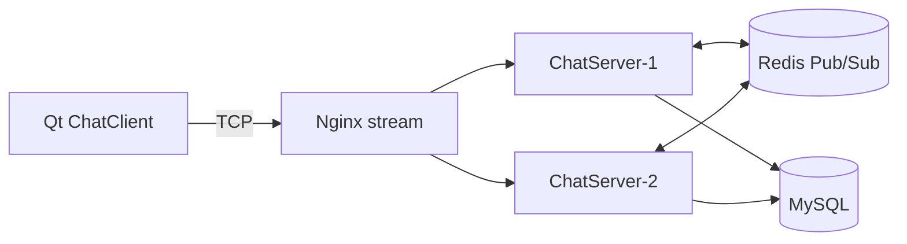

# MyChat (Resume Edition)

一个基于 Linux/C++ 的 IM 系统，包含高并发服务端与 Qt 桌面客户端，支持好友/群组聊天、离线消息和分布式消息转发。

## 项目亮点
- 服务端采用 Muduo Reactor 模型，面向高并发连接场景。
- 支持单聊、群聊、离线消息、好友和群组管理。
- Redis Pub/Sub 实现多实例间消息路由，支持横向扩展。
- Qt 客户端提供现代化 UI（登录、会话区、好友/群组列表、搜索过滤）。
- CMake 支持模块化构建（可单独构建客户端），并支持 `cpack` 产出发布包。

## 技术栈
- C++11, CMake
- Muduo
- MySQL
- Redis
- Qt5/Qt6 Widgets

## 架构

```mermaid
flowchart LR
  UI[Qt ChatClient] -->|TCP| LB[Nginx stream]
  LB --> S1[ChatServer-1]
  LB --> S2[ChatServer-2]
  S1 <--> R[(Redis Pub/Sub)]
  S2 <--> R
  S1 --> DB[(MySQL)]
  S2 --> DB
```

## 快速开始

### 1) 仅构建 Qt 客户端（推荐先跑通）
```bash
cd MyChatServer
BUILD_SERVER=OFF BUILD_CLIENT=ON ./autobuild.sh
./scripts/run_client.sh
```

### 2) 构建完整项目（服务端 + 客户端）
```bash
cd MyChatServer
BUILD_SERVER=ON BUILD_CLIENT=ON ./autobuild.sh
```

### 2.1) 服务端依赖安装（Ubuntu 20.04 示例）
```bash
sudo apt update
sudo apt install -y build-essential cmake redis-server mysql-server default-libmysqlclient-dev libhiredis-dev git
```

Muduo 需要单独安装：
```bash
cd /tmp
git clone https://github.com/chenshuo/muduo.git
cd muduo
./build.sh
cd build/release-cpp11
sudo make install
sudo ldconfig
```

### 2.2) 启动后端服务并运行联调
```bash
sudo systemctl start redis
sudo systemctl start mysql

cd MyChatServer
BUILD_SERVER=ON BUILD_CLIENT=ON ./autobuild.sh
./bin/ChatServer
```

新开终端运行客户端：
```bash
cd MyChatServer
./bin/ChatClient
```

### 3) 打包发布（客户端 TGZ）
```bash
cd MyChatServer
./scripts/package_release.sh
```

产物默认输出到：
- 可执行文件：`bin/`
- 打包文件：`dist/`

## 目录说明
- `src/server/`: 服务端核心（网络、业务、数据库、Redis）
- `src/client/`: Qt 桌面客户端
- `include/`: 公共头文件
- `scripts/`: 运行与打包脚本
- `thirdparty/`: 第三方依赖头文件

## 客户端功能（当前）
- 登录窗口（现代化样式）
- 聊天主界面（深色主题）
- 好友/群组列表展示
- 联系人搜索过滤
- 会话切换与时间戳消息展示

## 服务端依赖说明
服务端编译需要以下依赖：
- muduo 开发库（头文件与 `libmuduo_net/libmuduo_base`）
- mysqlclient 开发库
- hiredis 开发库

当依赖不完整时，CMake 会跳过 `ChatServer` 目标并给出提示，不影响客户端构建。

## 面试展示建议
- 展示「客户端可独立构建 + 服务端按依赖可选构建」的工程化能力。
- 强调 `autobuild.sh`、`scripts/package_release.sh` 的自动化交付能力。
- 演示好友/群组列表、搜索过滤、会话切换等 Qt 产品体验优化。
- 说明分布式链路：`Nginx -> ChatServer(多实例) -> Redis -> MySQL`。

## 发布产物
- 客户端可执行：`bin/ChatClient`
- 打包产物：`dist/MyChat-1.0.0-Linux.tar.gz`

## License
仅用于学习与面试项目展示。

