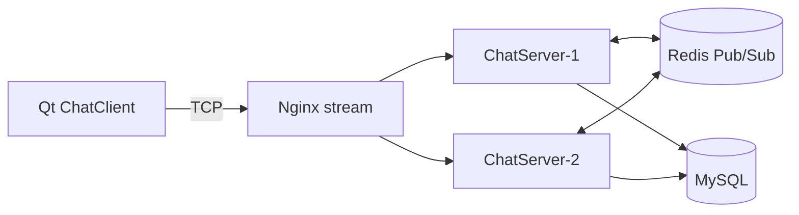

# MyChat · Modern C++ IM System

<p align="center">
  <b>一个面向高并发场景的 C++ 即时通讯项目</b><br/>
  <sub>Muduo + MySQL + Redis + Qt 客户端 + CMake 工程化构建</sub>
</p>

<p align="center">
  
  
  
  
  
</p>

---

## ✨ 项目简介

MyChat 是一个基于 Linux/C++ 的即时通讯系统，包含：
- **高并发服务端**（Muduo Reactor 网络模型）
- **桌面客户端**（Qt Widgets）
- **分布式消息转发能力**（Redis Pub/Sub）

当前已实现单聊/群聊、好友和群组管理、离线消息、多实例消息路由等核心能力，适合作为课程设计、毕业设计或面试项目展示。

---

## 🚀 核心亮点

- **高并发网络层**：基于 Muduo 的事件驱动模型，解耦连接管理与业务处理。
- **完整 IM 基础能力**：登录注册、好友管理、群聊、离线消息存储与拉取。
- **分布式扩展路径清晰**：Redis Pub/Sub 支持多实例间跨节点消息分发。
- **客户端体验优化**：现代化 Qt UI（登录页、会话页、联系人与群组列表、搜索过滤）。
- **工程化交付**：CMake 模块化构建、脚本化构建与打包（`autobuild.sh` / `package_release.sh`）。

---

## 🧰 技术栈

| 分层 | 技术 |
|---|---|
| 语言/标准 | C++11 |
| 构建系统 | CMake |
| 网络框架 | Muduo |
| 数据存储 | MySQL |
| 消息总线 | Redis Pub/Sub |
| 客户端 | Qt5/Qt6 Widgets |

---

## 🏗️ 系统架构


```mermaid
flowchart LR
  UI[Qt ChatClient] -->|TCP| LB[Nginx stream]
  LB --> S1[ChatServer-1]
  LB --> S2[ChatServer-2]
  S1 <--> R[(Redis Pub/Sub)]
  S2 <--> R
  S1 --> DB[(MySQL)]
  S2 --> DB
```

### 架构说明
- 客户端通过 TCP 与 ChatServer 通信。
- 多个 ChatServer 实例通过 Redis 进行跨节点消息同步。
- MySQL 负责用户、好友关系、群组、离线消息等持久化数据。

---

## ⚡ 快速开始

> 推荐先跑通客户端，再联调服务端。

### 1) 仅构建 Qt 客户端（推荐）

```bash
cd MyChatServer
BUILD_SERVER=OFF BUILD_CLIENT=ON ./autobuild.sh
./scripts/run_client.sh
```

### 2) 构建完整项目（服务端 + 客户端）

```bash
cd MyChatServer
BUILD_SERVER=ON BUILD_CLIENT=ON ./autobuild.sh
```

### 3) 启动服务端并联调

```bash
sudo systemctl start redis
sudo systemctl start mysql

cd MyChatServer
./bin/ChatServer
```

新开终端运行客户端：

```bash
cd MyChatServer
./bin/ChatClient
```

---

## 📦 依赖安装（Ubuntu 20.04 示例）

### 基础依赖

```bash
sudo apt update
sudo apt install -y build-essential cmake redis-server mysql-server default-libmysqlclient-dev libhiredis-dev git
```

### 安装 Muduo

```bash
cd /tmp
git clone https://github.com/chenshuo/muduo.git
cd muduo
./build.sh
cd build/release-cpp11
sudo make install
sudo ldconfig
```

---

## 📁 项目结构

```text
MyChatServer/
├─ src/
│  ├─ server/        # 服务端核心：网络层、业务层、DB、Redis
│  └─ client/        # Qt 客户端
├─ include/          # 公共头文件
├─ scripts/          # 构建、运行、打包脚本
├─ thirdparty/       # 第三方头文件
├─ bin/              # 可执行输出
└─ dist/             # 打包输出
```

---

## 🖥️ 客户端功能（当前）

- 登录窗口（现代化样式）
- 聊天主界面（深色主题）
- 好友/群组列表展示
- 联系人搜索过滤
- 会话切换与时间戳消息展示

---

## 🧠 服务端能力（当前）

- 用户登录/注册
- 好友关系维护
- 群组创建与群聊
- 离线消息存储与上线拉取
- Redis 通道订阅/发布（跨实例消息转发）

> 若服务端依赖不完整，CMake 会跳过 `ChatServer` 目标并提示，不影响客户端构建。

---

## 🎁 打包发布

```bash
cd MyChatServer
./scripts/package_release.sh
```

默认产物位置：
- 可执行文件：`bin/`
- 打包文件：`dist/`

当前示例产物：
- `bin/ChatClient`
- `dist/MyChat-1.0.0-Linux.tar.gz`

---

## 📸 界面展示（建议）

你可以将截图放在 `docs/images/` 后，按以下方式展示：

```markdown


```

---

## 💼 面试讲解建议

- 从 **架构链路** 讲起：`Nginx -> ChatServer(多实例) -> Redis -> MySQL`
- 强调 **工程能力**：可选构建、脚本化交付、打包发布
- 展示 **用户体验**：Qt 客户端交互与视觉优化
- 说明 **扩展方向**：消息可靠投递、文件传输、鉴权与安全策略

---

## 🗺️ Roadmap

- [ ] 消息已读/未读状态同步
- [ ] 文件与图片消息支持
- [ ] Docker 一键部署
- [ ] CI 自动构建与发布
- [ ] 更完善的日志与监控体系

---

## License

本项目仅用于学习与面试展示。

